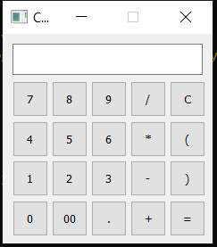

# Basic Calculator Using Python Library PyQt5.
This Application is basically Devided into three steps.
## 1. Create UI of the application.
UI is basically the Interface which the user can see.


## 2. Create the controller.
It is a class that connects code with the UI


## 3. Create Model
This is the main Logic behind the logic of the programe like on button press which function to be trigerred.


# Steps
## 1: Install pyqt

## 2: Test installation
To check installation and basic woking of pyqt follow steps below
- Create file test.py
```
import sys

from PyQt5.QtWidgets import QAplication
from PyQt5.QtWidgets import QLabel
from PyQt5.QtWidgets import QWidget
```
- Go to CMD and run python test.py
If installtion is working this run will not give any error

- Now add following lines to check how to create GUI in pyqt

This code is going to create GUI but will not retain window(When you run code it will show window and exit)
```
app = QApplication(sys.argv)

window = QWidget()
window.QLabel("This is Test", parent = window)
window.show()
```
- To retain window add following code
```
sys.exit(app.exce_())
```

- Also, add following code lines to experiment moe
```
window.setGeometry(100, 100, 280, 80) # It will set  x, y, w, h of app window
window.move(600,400) # Move window x from left and y from top
```

## 3: Create view of application i.e. GUI

- Create class named view.py
- Import following modules
```
from PyQt5.QtWidgets import QMainWindow
from PyQt5.QtWidgets import QWidget
from PyQt5.QtWidgets import QGridLayout
from PyQt5.QtWidgets import QLineEdit
from PyQt5.QtWidgets import QPushButton
from PyQt5.QtWidgets import QVBoxLayout
```
- Create class GUI with parent set to QMainWindow
```
class GUI(QMainWindow):
```
- Add Constructor
...It will initiate main window by calling superclass constuctor and setting basic parametes such as
..* WindowTitle
..* Size
..* generalLayout
..* LED Display
..* Buttons

- Define methods
..* _createDisplayLED
..* _createButtons
..* setDisplayText
..* getDisplayText
..* clearDisplay

## 4: Create Model of application
- Evaluting the Expression
```
def evaluateExpression(expression):
    """Evaluate an expression."""
    try:
        result = str(eval(expression, {}, {})) 
    except Exception:
        result = ERROR_MSG

    return result
```
## 5: Create Controller of application
- Create a Controller class to connect the GUI and the model
Evaluate expressions.
```
result = self._evaluate(expression=self._view.getDisplayText())
        self._view.setDisplayText(result)
```
Build expression.
```
if self._view.getDisplayText() == ERROR_MSG:
            self._view.clearDisplay()
expression = self._view.getDisplayText() + sub_exp
self._view.setDisplayText(expression)
```
Connect signals and slots.
```
for btnText, btn in self._view.buttons.items():
            if btnText not in {'=', 'C'}:
                btn.clicked.connect(partial(self._buildExpression, btnText))

self._view.buttons['='].clicked.connect(self._calculateResult)
self._view.display.returnPressed.connect(self._calculateResult)
self._view.buttons['C'].clicked.connect(self._view.clearDisplay)
```

# Actual Output of the code looks like this:

